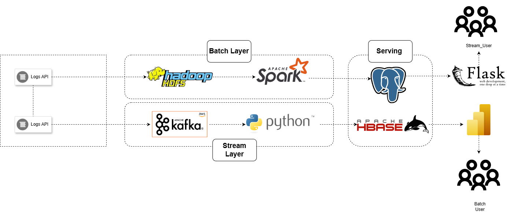
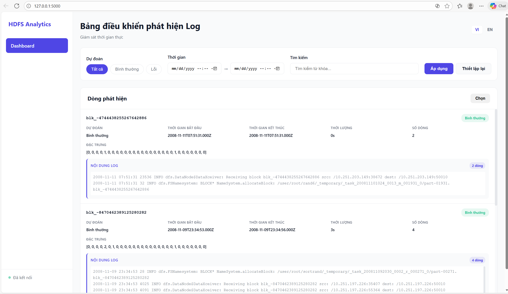
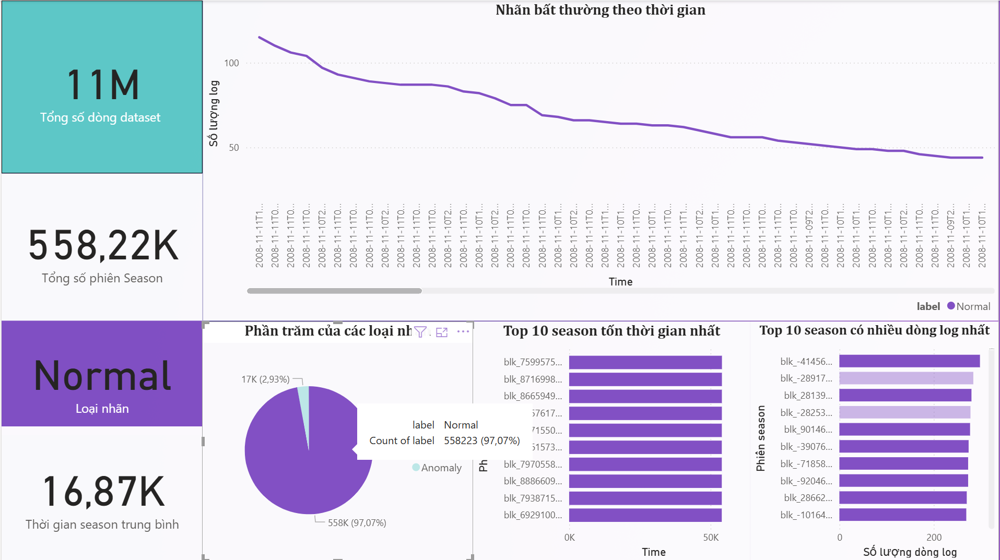

# 🔍 Loghub Detection – Lambda Architecture

<p align="center">
  
  
  
  
  
</p>

Hệ thống phân tích log HDFS theo thời gian thực & batch.

---

# 📌 Giới thiệu

Loghub Detection là hệ thống phát hiện và phân tích log HDFS dựa trên kiến trúc **Lambda Architecture**, kết hợp cả:

- **Batch Layer** – xử lý dữ liệu log lịch sử (file Loghub lớn).
- **Speed Layer (Streaming)** – xử lý log mới theo thời gian thực qua Kafka.
- **Serving Layer** – cung cấp kết quả hợp nhất cho API/UI.

Mục tiêu hệ thống:

- Chuẩn hóa log HDFS (block, timestamp, duration...).
- Phát hiện bất thường (anomaly) hoặc lỗi block.
- Lưu trữ phân tán với HBase.
- Giám sát realtime qua Kafka Producer/Consumer.

---

# 🧱 Kiến trúc tổng quan



---

# 🗂️ Cấu trúc thư mục project

```
BIG-DATA/
├── jobs/
│   └── app/
│       └── loghub-detection/
│           ├── __pycache__/
│           ├── static/
│           ├── templates/
│           ├── app.py
│           ├── config.py
│           ├── docker-compose.yaml
│           ├── Dockerfile
│           ├── get_data_from_hbase.py
│           ├── hbase_client.py
│           └── Makefile
│
├── batch_layer/
│   └── batch_analysis/
│       ├── base/
│       ├── data/
│       ├── datanode/
│       ├── hdfs/
│       ├── historyserver/
│       ├── namenode/
│       ├── nginx/
│       ├── nodemanager/
│       ├── notebook/
│       ├── resourcemanager/
│       ├── docker-compose.yml
│       ├── hadoop.env
│       ├── Makefile
│       └── README.md
│
├── Power_BI/
│
├── load_data_to_sql.py
│
├── data/
│
├── model_ML/
│
├── stream_layer/
│   ├── __pycache__/
│   ├── docker-compose.yml
│   ├── HDFS.log_templates.csv
│   ├── insert_data_to_HBase.py
│   ├── kafka_consumer.py
│   ├── kafka_producer.py
│   ├── ML_predict.py
│   ├── pipeline_stream.py
│   ├── stream_data.py
│   └── transform.py
│
├── .env
├── ip_localhost.txt
├── lambda.drawio.png
├── README.md
└── spec.txt

```

---

# ⚙️ Batch Layer – Xử lý dữ liệu log lịch sử

### 📥 Input

- File log từ Loghub HDFS dạng `.log` .

### 🧹 Các bước xử lý bằng Spark

- Tách `BlockId` (`blk_...`).
- Trích xuất `start_ts`, `end_ts`, tính `duration_sec`.
- Gom log theo từng block thành **block session**.
- Tính tổng số dòng log (`num_lines`).
- Chuẩn hóa dữ liệu về dạng **row-based** phục vụ phân tích và huấn luyện mô hình.

### 📤 Output

```
blockId | start_ts | end_ts | duration_sec | log_full | num_lines
```

Lưu vào:

- HDFS và  `batch_layer/batch_layer/data`
- PosterSQL

---

# ⚡ Speed Layer – Xử lý realtime bằng Kafka

### 1) Log Generator

Sinh log mô phỏng realtime:

```json
{
  "blockId": "...",
  "start_ts": "...",
  "end_ts": "...",
  "duration_sec": 0,
  "num_lines": 2,
  "log_full": "raw text..."
}
```

### 2) Kafka Producer

Gửi JSON message vào topic:

```
topic = loghub-realtime
```

### 3) Kafka Consumer

Nhận log → Transform→ Predict → Lưu vào HBase.

### 4) HBase Storage Schema

```
table: loghub
column family: info
columns:
  - start_ts
  - end_ts
  - duration
  - log_full
  - num_lines
```

Mỗi block là một row-key.

---

# 🏦 Serving Layer

Serving Layer kết hợp dữ liệu từ:

| Nguồn               | Chức năng                         |
| -------------------- | ----------------------------------- |
| **Batch View** | dữ liệu lịch sử, đầy đủ     |
| **Speed View** | dữ liệu realtime (Kafka → HBase) |

Tất cả được lưu trong HBase và query qua API/UI.

---

# 🚀 Cách chạy project

### 1) Chạy Batch Layer

Khởi động Docker

```bash
cd jobs/batch_layer/batch_analysis
docker-compose up -d
```

Thêm dữ liệu vào HDFS

```bash
hdfs dfs -mkdir -p /user/root/data/tmp/datack/
hdfs dfs -put HDFS.log /user/root/data/tmp/datack/
```

Mở container Jupyter NoteBook tại địa chỉ : localhost:8888

Lưu dữ liệu vào PosterSQL

```bash
python load_data_to_sql.py
```

### 2) Stream Layer

Khởi động Docker

```bash
cd jobs/stream_layer
docker compose up -d
```

Chạy mô phòng stream

```bash
python pipeline_stream.py
```

### 3) Hiển thị giao diện

```bash
cd jobs/app/loghub_detection
python app.py
```

---

# 🧪 Kết quả demo





---

# 📈 Hướng phát triển

- Thêm module anomaly detection.
- Dùng PySpark Streaming thay Python Consumer.
- Tối ưu storage bằng HBase compression.
- Dashboard realtime bằng Grafana.

---

# 📚 Tài liệu tham khảo

- [Loghub Dataset](https://github.com/logpai/loghub)
- [Apache Kafka](https://kafka.apache.org/)
- [Apache HBase](https://hbase.apache.org/)
- [Apache Spark](https://spark.apache.org/)
- [Lambda Architecture (Batch + Speed)](https://lambda-architecture.net/)

---


# 👥 Thành viên nhóm

| Họ và tên                    | Mã sinh viên |
| ------------------------------- | -------------- |
| **Nguyễn Văn Việt**    | 23020430       |
| **Ngô Đinh Minh Nhật** | 23020408       |
| **Kiều Đức Nam**       | 23020404       |
